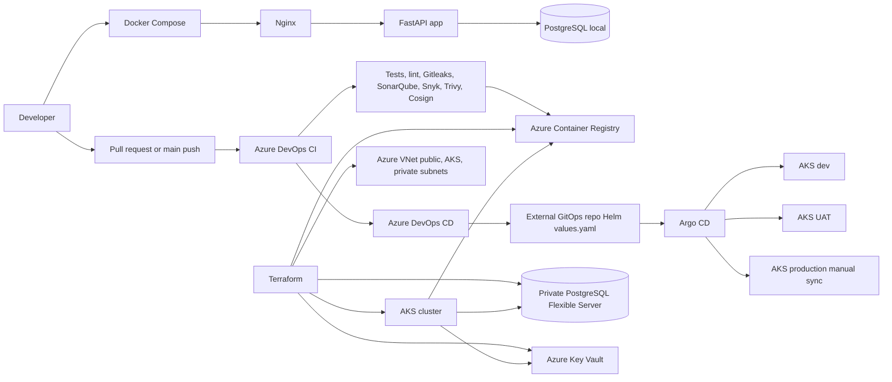

# FastAPI Health Check App

A containerized FastAPI health-check service with PostgreSQL, Nginx, Azure DevOps CI/CD, Azure Container Registry, Argo CD GitOps, and Terraform infrastructure.

## Features

- FastAPI endpoints at `/` and `/health`
- PostgreSQL database health check
- Nginx reverse proxy
- Docker Compose local development
- Azure DevOps CI with tests, linting, Gitleaks, SonarQube, Snyk, Trivy, and Cosign
- Helm values promotion through Argo CD for dev, UAT, and production
- Terraform infrastructure for Azure networking, AKS, ACR, PostgreSQL, Key Vault, and RBAC

## Requirements

### Local development

- Docker and Docker Compose
- Python 3.12 or newer for local validation

### CI/CD and deployment

- Azure DevOps project and agent pool
- Azure Container Registry
- Kubernetes cluster with Argo CD
- External GitOps repository containing Helm charts and environment-specific `values.yaml` files

## Run Locally With Docker Compose

Create the local environment file and start the complete stack:

```bash
cp .env.example .env
docker compose up --build
```

Stop the stack with:

```bash
docker compose down
```

Services:

| Service | Address |
| --- | --- |
| FastAPI app | http://localhost:8000 |
| Health check | http://localhost:8000/health |
| Nginx | http://localhost |
| PostgreSQL | localhost:5432 |

The application uses these local environment variables:

```env
DATABASE_URL=postgresql+asyncpg://appuser:secret@db:5432/healthdb
POSTGRES_DB=healthdb
POSTGRES_USER=appuser
POSTGRES_PASSWORD=secret
```

Do not commit real secrets. Use Azure Key Vault or another secure secret store in production.

## API

### `GET /`

```json
{
  "message": "FastAPI service is running"
}
```

### `GET /health`

```json
{
  "status": "ok",
  "database": "connected"
}
```

The health endpoint returns `degraded` when no database URL is configured and `unhealthy` when the database cannot be reached.

## CI/CD Pipeline Stages

CI pipeline: [task-2-ci-cd/azure-pipelines-ci.yml](task-2-ci-cd/azure-pipelines-ci.yml)

The CI pipeline runs for pull requests and pushes to `main`:

| Stage | What it does | Failure behavior |
| --- | --- | --- |
| `UnitTests` | Installs dependencies and runs `pytest`. | Test failure stops the pipeline. |
| `Lint` | Runs Ruff and Python compilation checks. | Any lint or syntax failure stops the pipeline. |
| `SecretScan` | Scans the complete Git history with Gitleaks. | Any detected secret exits with code `1`. |
| `SonarQube` | Runs source and dependency analysis and publishes the quality gate. | A failed quality gate stops the pipeline. |
| `SAST` | Uses Snyk to scan third-party Python dependencies in `requirements.txt`. | Any dependency vulnerability exits nonzero. |
| `BuildImage` | Builds the image once and exports it as a pipeline artifact. | Build or artifact failure stops the pipeline. |
| `Trivy` | Scans the exact exported image for vulnerabilities. | Any vulnerability exits with code `1`. |
| `SignImage` | Signs and verifies the exact image artifact with Cosign. | A missing or invalid signature stops the pipeline. |
| `Publish` | Pushes the scanned and signed image to ACR from `main`. | Publish runs only after every previous stage succeeds. |

The image is tagged with its commit SHA and `latest`. The same image artifact is built, scanned, signed, and published; it is not rebuilt between security scanning and publishing.

Required Azure DevOps configuration:

- Docker Registry service connection: `acr-service-connection`
- SonarQube service connection: `sonarqube-service-connection`
- Pipeline variable: `ACR_LOGIN_SERVER`
- Pipeline variable: `SONAR_PROJECT_KEY`
- Secret variable: `SNYK_TOKEN`
- Secret variables: `COSIGN_PRIVATE_KEY`, `COSIGN_PASSWORD`, and `COSIGN_PUBLIC_KEY`

## CD Promotion Stages

CD pipeline: [task-2-ci-cd/azure-pipelines-cd.yml](task-2-ci-cd/azure-pipelines-cd.yml)

The CD pipeline is triggered by a successful CI run on `main`:

```text
VerifyImage -> DeployDev -> DeployUat -> Approval -> DeployProd
```

- `VerifyImage` downloads the exact CI image and Cosign signature artifacts and verifies that the signature matches the image.
- `DeployDev` updates only the dev Helm `values.yaml`; Argo CD auto-syncs dev.
- `DeployUat` updates only the UAT Helm `values.yaml`; Argo CD auto-syncs UAT.
- `Approval` pauses for manual production approval.
- `DeployProd` updates only the production Helm `values.yaml`; production Argo CD auto-sync remains disabled and requires manual sync.

Create the Azure DevOps variable group `db-health-check-cd`:

| Variable | Purpose |
| --- | --- |
| `GITOPS_REPOSITORY` | HTTPS clone URL of the external GitOps repository. |
| `GITOPS_BRANCH` | Branch monitored by Argo CD, normally `main`. |
| `GITOPS_TOKEN` | Secret PAT with permission to push the GitOps repository. |
| `GITOPS_VALUES_FILE_DEV` | Dev Helm `values.yaml` path. |
| `GITOPS_VALUES_FILE_UAT` | UAT Helm `values.yaml` path. |
| `GITOPS_VALUES_FILE_PROD` | Production Helm `values.yaml` path. |
| `COSIGN_PUBLIC_KEY` | Public key matching the CI signing key. |

### Rollback

Run CD manually with `rollback: true`, select `rollbackEnvironment` as `dev`, `uat`, or `prod`, and provide `previousImageTag` as the previously deployed, known-good commit SHA stored in ACR. Rollback updates only the selected Helm `values.yaml` tag and commits with `[skip ci]`. Argo CD redeploys the previous image; production still requires manual Argo CD sync.

## Argo CD GitOps

Argo CD definitions: [task-2-ci-cd/gitops/argocd/application.yaml](task-2-ci-cd/gitops/argocd/application.yaml)

The external GitOps repository is expected to contain:

```text
environments/dev/<helm-chart>/values.yaml
environments/uat/<helm-chart>/values.yaml
environments/prod/<helm-chart>/values.yaml
```

| Environment | Sync behavior |
| --- | --- |
| Dev | Automated sync, self-heal, and prune. |
| UAT | Automated sync, self-heal, and prune. |
| Production | No automated sync; an operator reviews and manually syncs. |

The CD pipeline edits only Helm `values.yaml` files. Kubernetes manifests are rendered by the Helm chart and are not edited by CD.

## Infrastructure as Code

Task 3 Terraform is in [task-3-infrastructure](task-3-infrastructure/):

- `main.tf`: VNet, public/AKS/private subnets, NSGs, AKS, ACR, PostgreSQL, Key Vault, monitoring, and RBAC.
- `variables.tf`: typed infrastructure inputs, including the sensitive database password.
- `versions.tf`: Terraform and AzureRM provider requirements.
- `outputs.tf`: ACR, AKS, PostgreSQL, and Key Vault outputs.
- `terraform.tfvars.example`: non-secret example values.

Validate without an Azure deployment:

```bash
terraform -chdir=task-3-infrastructure init -backend=false
terraform -chdir=task-3-infrastructure validate
```

The PostgreSQL password must be supplied through a secure variable or ignored `.tfvars` file. Never commit the real password.

## Architecture



## Assumptions And Future Improvement

### Assumptions

- The external GitOps repository already contains compatible Helm charts and separate values files for dev, UAT, and production.
- Azure DevOps service connections, variable groups, approvals, SonarQube, Snyk, and signing keys are configured outside this repository.
- Argo CD is already installed in the target Kubernetes cluster and has access to the GitOps repository.
- The Terraform deployment targets an existing Azure resource group.


### One improvement with more time

I would replace detached Cosign tarball signatures with registry-based Cosign signatures bound to the immutable ACR image digest, then enforce signature verification with an admission policy in AKS. That would verify the exact image pulled by the cluster rather than only the CI artifact handoff.

## Repository Structure

```text
.
├── app/
│   ├── __init__.py
│   └── main.py
├── tests/
│   └── test_app.py
├── task-2-ci-cd/
│   ├── azure-pipelines-ci.yml
│   ├── azure-pipelines-cd.yml
│   └── gitops/argocd/application.yaml
├── task-3-infrastructure/
│   ├── main.tf
│   ├── variables.tf
│   ├── versions.tf
│   ├── outputs.tf
│   └── terraform.tfvars.example
├── Dockerfile
├── docker-compose.yml
├── nginx.conf
├── requirements.txt
├── verify_app.py
└── README.md
```
